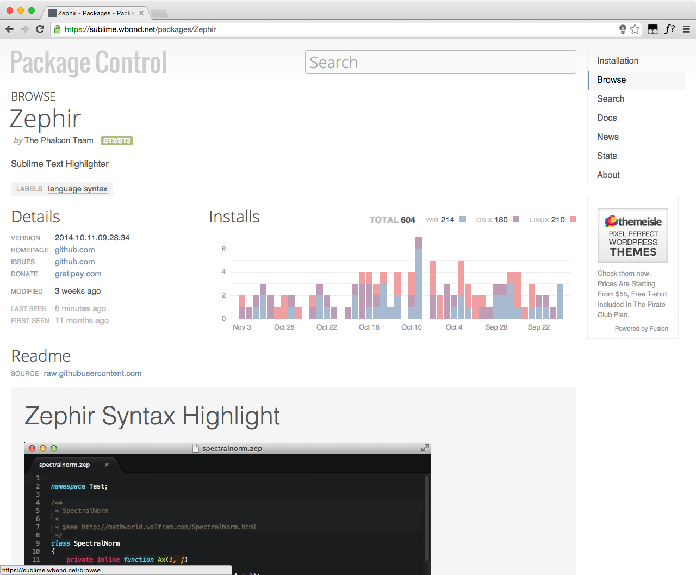
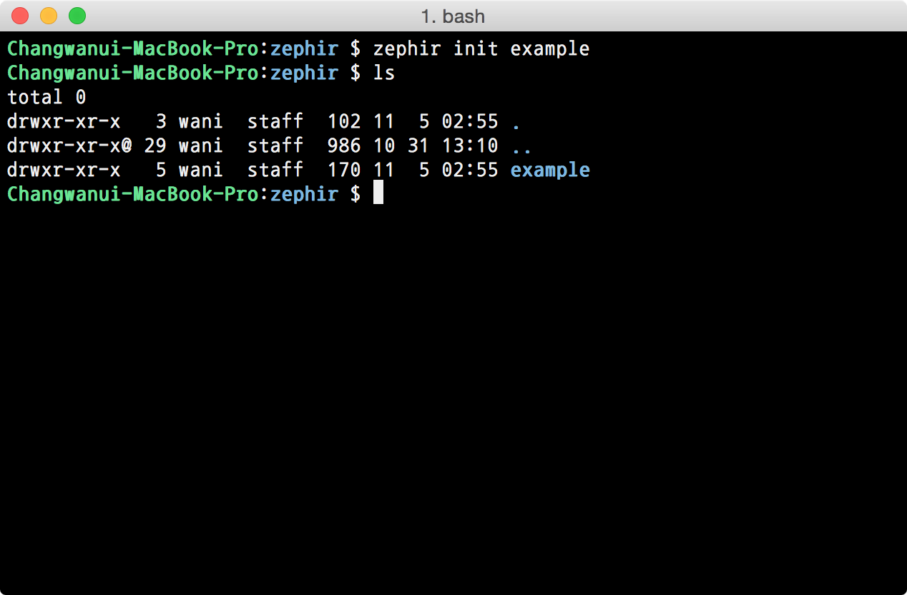
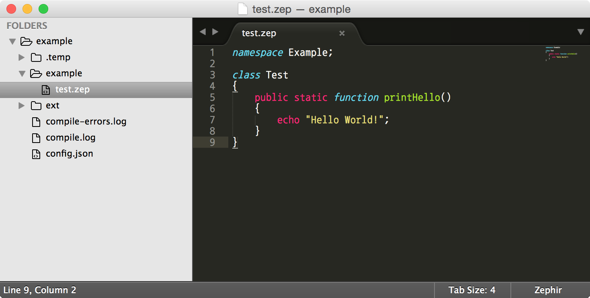
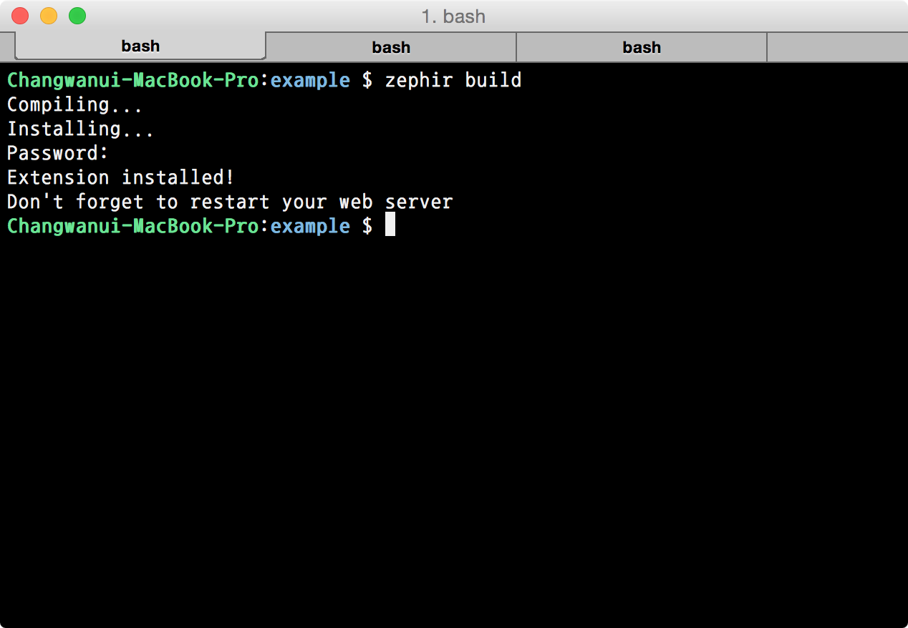
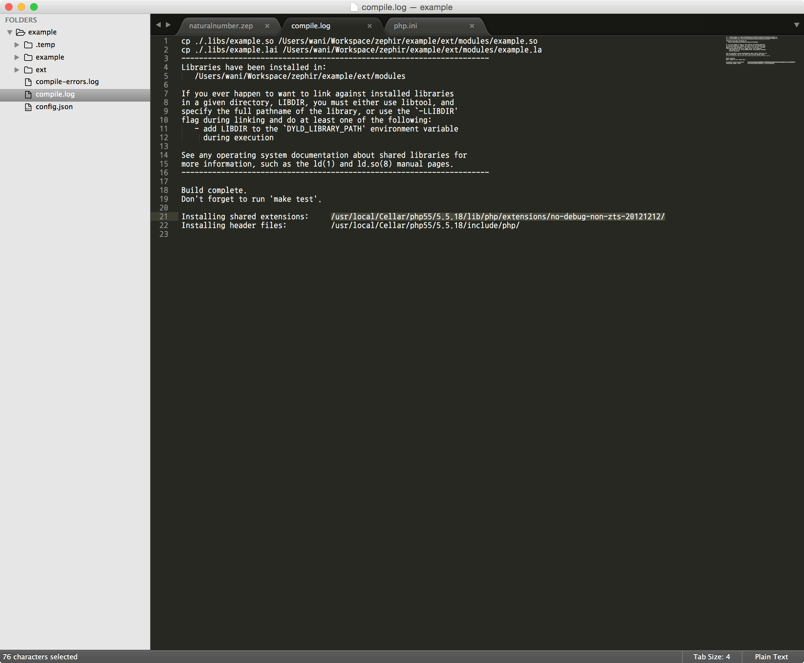
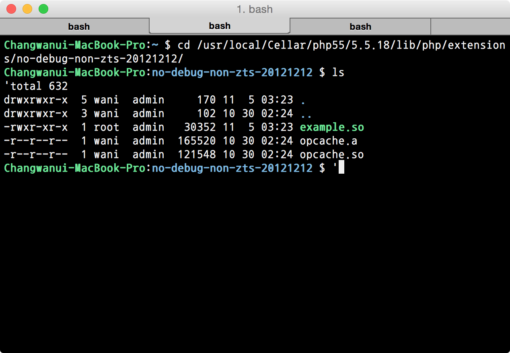
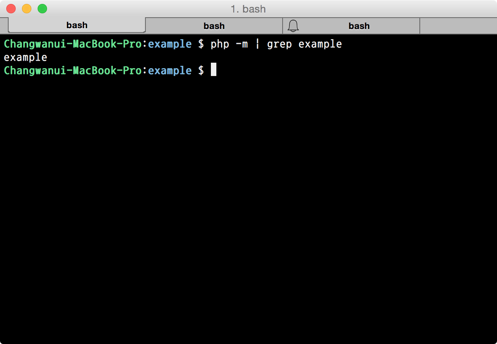
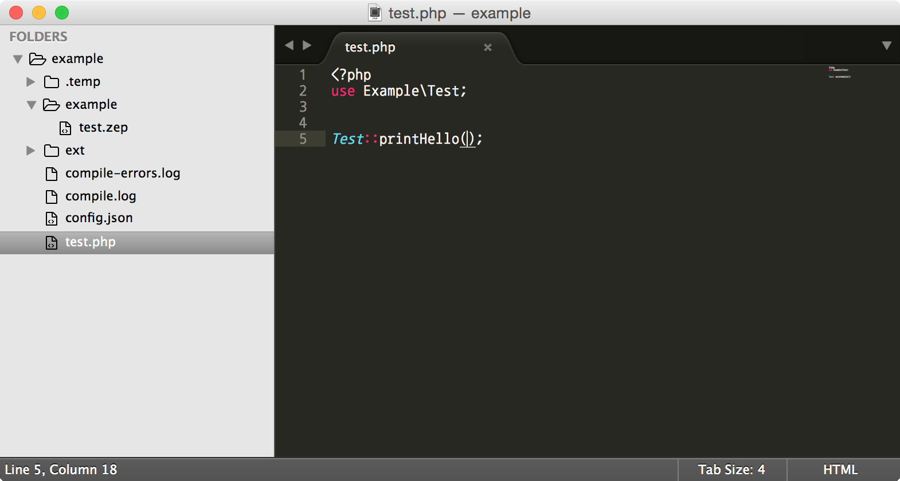
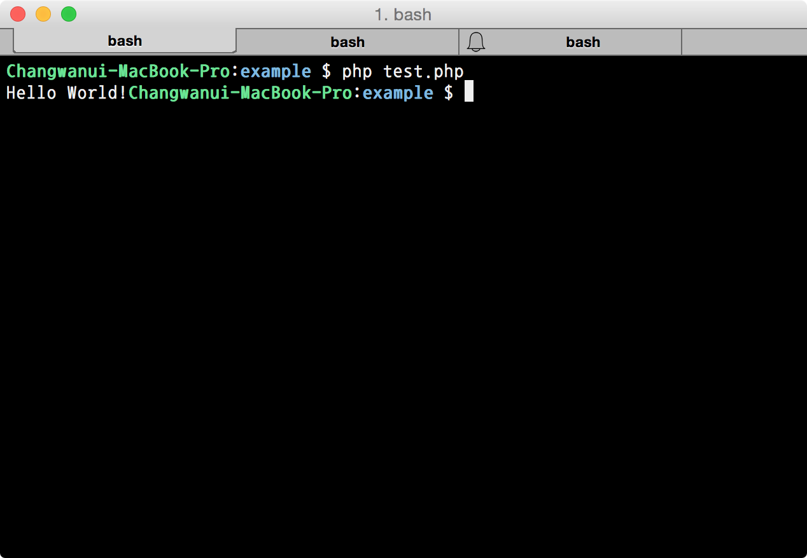
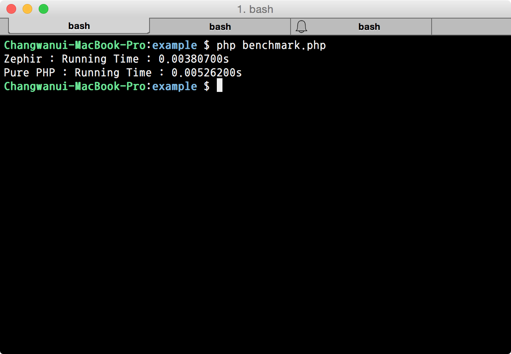

title : Git, Intro.
output : index.html
author:
	name : changwan jun
theme : sudodoki/reveal-cleaver-theme 
style : my.css

--

# 내맘대로 Zephir

--

## Why Zephir?

- PHP가 가진 생산성!
- C가 갖고 있는 Low-Level 접근성, 빠른 성능!
- 코드 보호..

--


--

## 어떻게 돌아가지?


--

## 설치는 쉬운편입니다.

```bash
$ git clone https://github.com/phalcon/zephir
$ cd zephir
$ ./install-json
$ ./install -c
```

~~brew에는 없습니다.~~

--

### **주의하셔야 합니다.**

처음에 설치하는데 사용한 zephir폴더를 지우면  
zephir가 실행이 되지 않습니다.  
처음에 설치할 때, 폴더 위치를 잘 잡아야 합니다.

--

### 팁 하나더!




--

## 만들어 봅시다!

--



--

파일구조를 잘 보셔야 합니다.  
네임스페이스와 클래스 이름 => 폴더구조와 파일 명



--



--


메뉴얼에서는 알아서 잡힌다고 했는데..  
저는 왜 안되는거죠..

--

### 멘땅의 헤딩..

--



--

찾았습니다!



--

```bash
$ cd /usr/local/etc/php/5.5/conf.d
$ vi ext-example.ini
```

```bash
[example]
extension=/usr/local/Cellar/php55/5.5.18/lib/php/extensions/no-debug-non-zts-
20121212/example.so
```

--

이렇게 나오면 성공한겁니다.



--

### 어서 돌려봅시다!

--



--

성공..!



--

## 문법을 잠깐 살펴봅시다.

--

### 변수 자료형

--

- Dynamic Type : 형변환이 자유롭습니다. (php)

```javascript
var a, b, c;

// Initialize variables
let a = "hello", b = false;

// Change their values
let a = 10, b = "140";

// Perform operations between them
let c = a + b;
```

--

- Static Type : 형변환이 제약적입니다. (c)

```javascript
int a;

let a = 50,
    a = -70,
    a = 100.25, // automatically casted to 100
    a = null, // automatically casted to 0
    a = false, // automatically casted to 0
    a = "hello"; // throws a compiler exception
```

--

### Condition & Loop

[http://zephir-lang.com/control.html](http://zephir-lang.com/control.html)

--

### Function Call

- PHP에 함수로 정의되어있는 녀석은 다 사용가능.
- 아쉽게도 클래스는 사용 불가능. (ex. Spl\*, Reflection\*..)

--

## 조금만 가지고 놀아보자면..

--

```php
<?php
class NaturalNumber
{
   public static function isPrime($number)
    {
    	$len = (int)sqrt($number);
    	
    	for( $i = 2; $i <= $len; $i++) {
    		if ($number % $i == 0) {
    			return false;
    		}
    	}
    	return true;
    }
}
```

--


```java
namespace Example;

class NaturalNumber
{

    public static function isPrime(int number)
    {
    	int len;
    	let len = (int)sqrt(number);

    	int i = 2;
    	while i <= len {

    		if number % i == 0 {
    			return false;
    		}
    		let i = i + 1;
    	}

    	return true;
    }
}

```

--

### 성능은?



--


--

## 한계

- 웹호스팅에서 사용불가능(당연한..)
- 모듈의 형태로만 개발할 수 있음.
- 다른 PHP모듈에 의존하기 힘듦.

--

## 애매한 것

- HHVM이랑 비교해서 성능은?
- PHPNG가 등장해도 살아남을까?

--

## 결론

- 언어자체만으로도 굉장히 재미남.
- 한번쯤 사용해보시면 어떨런지?

--

## 참고자료

- [http://zephir-lang.com](http://zephir-lang.com)
- [http://mygony.com/archives/4396](http://mygony.com/archives/4396)
