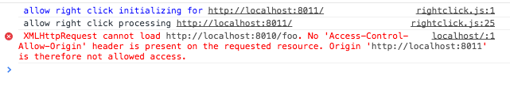
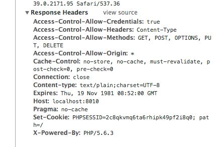
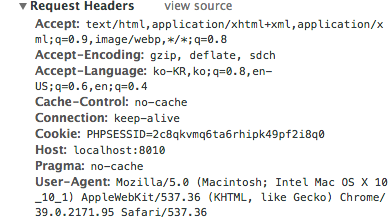

title : 쉽게 CORS
output : index.html
author:
	name : changwan jun
theme : sudodoki/reveal-cleaver-theme 
style : my.css

--

# Cross Domain Ajax 삽질기

--

## 요구사항

- 빠른 앱 개발
	- 웹앱을 개발하자
	- Single Page Application
	- 백앤드와 프론트 앤드가 분리되어있음
- 짧은 개발시간
	
--

"써봤던 것을 최대한 활용해서 ~~사브작사브작~~ 하면 되지 않을까?"

--

## 결정한 환경

- Frontend : Backbone.js
- Backend : Slim Framework

--

## Cross Domain Ajax?

- 고전 브라우저는 아무 문제 없이 됩니다.
- 브라우저 보안 문제 때문에 생긴 제약. (CORS)
- 뭐 간단히 얘기해서 잘 안돼요.



--

## 해결책은?

헤더에 접속 허용을 하는 헤더를 넣어주면 끝.

```php
header('Access-Control-Allow-Origin: *');
header('Access-Control-Allow-Methods: GET, POST, OPTIONS, PUT, DELETE');
header('Access-Control-Allow-Credentials: true');
header('Access-Control-Allow-Headers: Content-Type');
```

--

## 과연 이게 끝인가?

...그럴리가요...

--

## 로그인문제

크로스 도메인이 아니라면..




--

CORS에서는  
Cookie처리가 자동으로 되지 않습니다.

--

### 예제파일

- example-backend/src/Simple.php
- example-frontend/scripts/app.js

--

### 일반적인 상황에서의 해결책

```javascript
$.ajax({
	type: 'POST',
	url: 'http://localhost:8010/login',
	xhrFields: {
		withCredentials: true
	},
	crossDomain: true
});
```

--

헤더에서 Access-Control-Allow가 와일드카드면 사용이 안됩니다.  
(보안..보안..보안..)

```php
// header('Access-Control-Allow-Origin: *');

header('Access-Control-Allow-Origin: http://yourhome');
```

--

저는 일반적인 상황이 아니었습니다.


--

### None Cookie 기반의 세션 구현

```php
ini_set('session.use_cookies', 0);
ini_set('session.use_only_cookies', 0);
ini_set('session.use_trans_sid', 1);

session_name("pug_session");
session_start();

// 세션ID를 가져와야합니다.
echo session_id();
```

--

받아온 세션아이디를 가지고 직접 처리하자.

```javascript
$.ajax({
	type: 'GET',
	url: 'http://localhost:8010/cors/me?pug_session=' + sessionId
}).then(function(data) {
	var text = $('<pre>').html(data);
	$('#app').append(text);
});
```

--

## 남아있는 문제점

- POST, GET은 잘 되지만 PUT, DELETE 의 경우 에러가 납니다.
- Reqeust ContentType 문제.  
Slim의 경우 1,2를 지원, Backbone은 3을 지원.
	1. application/x-www-form-urlencoded
	2. multipart/form-data
	3. application/json

--

## 끗

### 질문?
