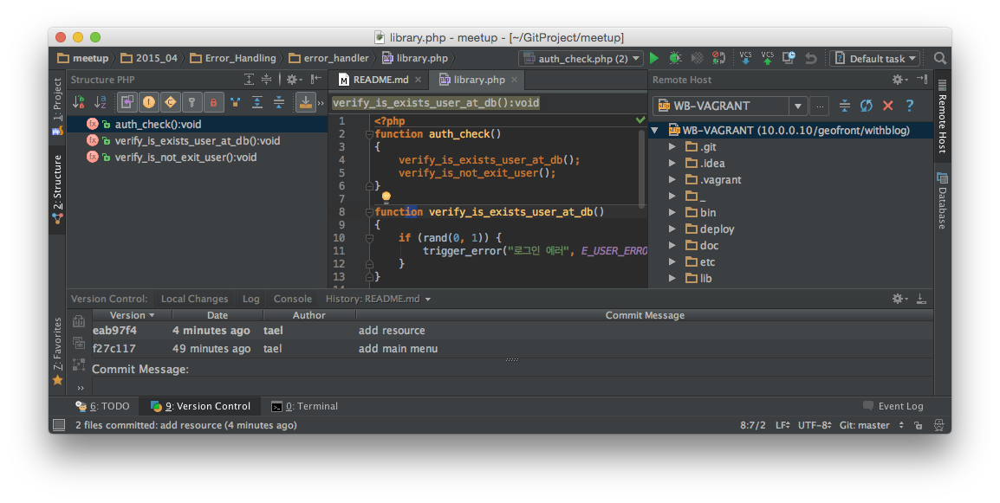

#PHPStorm 둘러보기

## IDE vs Editor
### 통합 개발 환경
 새로운 기능을 제공하는 것이 아니라, 개발 환경을 통합해 주는 것입니다. 기존에 없던 새로운 기능을 기대하거나 PHPStorm 만의 특별한 기능으로 착각해서는 안될 것입니다. 예를들면 `php-cs-fixer` 모듈을 통해 코딩스타일을 정정하는 것은 PHPStorm 의 고유한 기능이 아닙니다.
 
#### 포함된 기능들
- PHP 에디터 (HTML/CSS/JavaScript/...)
- 리팩토링
- 프레임워크 지원
- 디버깅
- 테스팅
- 프로파일링
- VCS
- 이슈트래커
- 데이터베이스
- 이력 추적
- UML
- vagrant
- composer
- Phing 지원
- 배포
- 원격 관리
- 기타등등 + Plugin

### 논쟁: 에디터와의 비교
 위의 내용과 같이 IDE 에서 지향하는 바는 개발환경의 '통합' 입니다.
이 중 텍스트 에디터는 IDE 의 기능에 포함된 일부라고 할 수 있습니다. 따라서 비교하고 우위를 점치는 것이 의미가 없을 것 같지만 가장 혼란스러워 하는 부분이니 짚고 넘어갑시다. 특히 PHPStorm 과 SublimeText 을 두고 비교를 많이 하게 되는데, 그 이유는 SublimeText 의 강력한 플러그인 기능 때문입니다. SublimeText 는 아주 훌륭한 텍스트 에디터 인데, 개발과 관련된 플러그인을 설치하여 개발환경을 통합하는 방법을 제공할 수 있기 떄문입니다. 심지어 텍스트 편집 기능 자체만 볼 때 PHPStorm 의 편집 기능보다 우월하다고 생각합니다.

([서브라임을 IDE 처럼 쓰는방법](http://www.websightdesigns.com/posts/view/how-to-set-up-sublime-text-as-an-ide))

훌륭한 에디터와 훌륭한 IDE 는 평가되는 관점이 다릅니다. 개발의 대부분이 코딩이고 에디터가 그 중요한 역할을 담당하는 것에는 변함이 없지만, 복잡한 개발 환경을 통합시키고 단순화 시키는 것은 개발자가 집중해야 하는 영역을 좁혀줄 수 있습니다.
에디터는 각각의 파일 편집을 기본으로 하고, IDE 는 프로젝트라는 형태로 연관된 디렉토리나, 파일 구조를 기본으로 다루고, 프로젝트별로 다른 환경을 기억할 수 있습니다.

## 둘러보기

### 메인 메뉴

### 네비게이션 바

### 상태바

### 에디터

### 마이스크린

