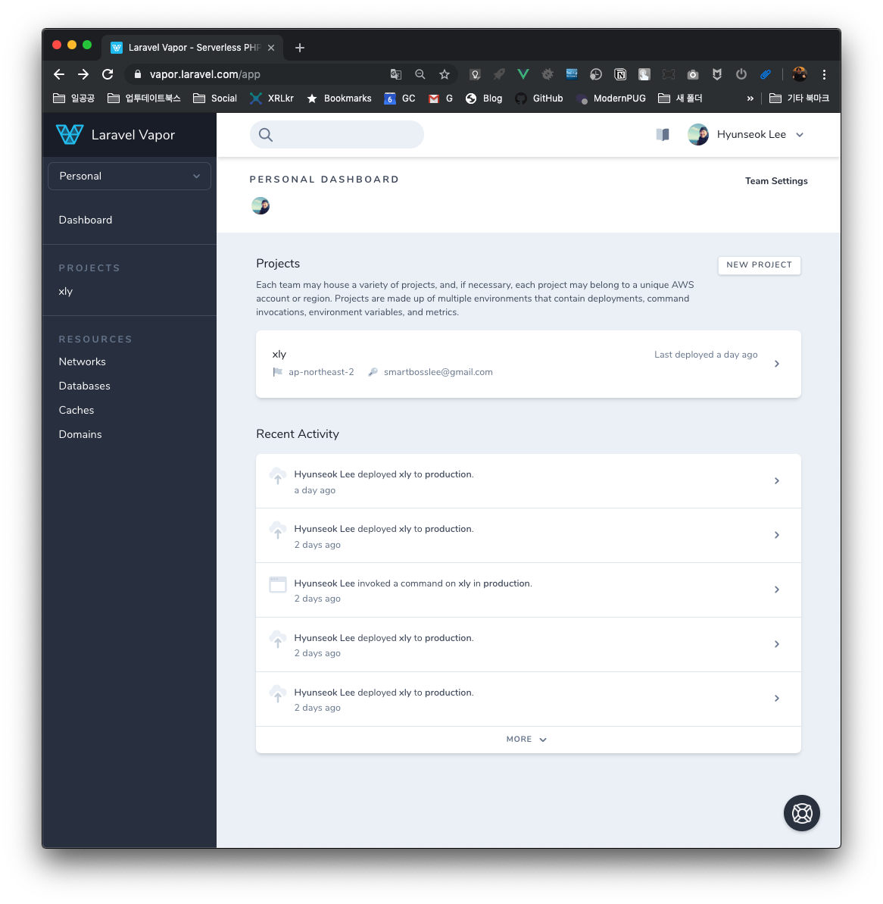
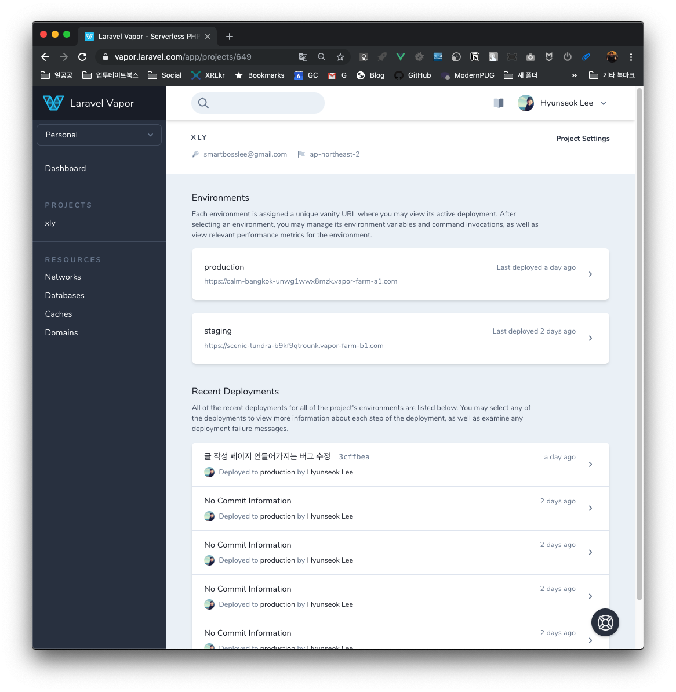
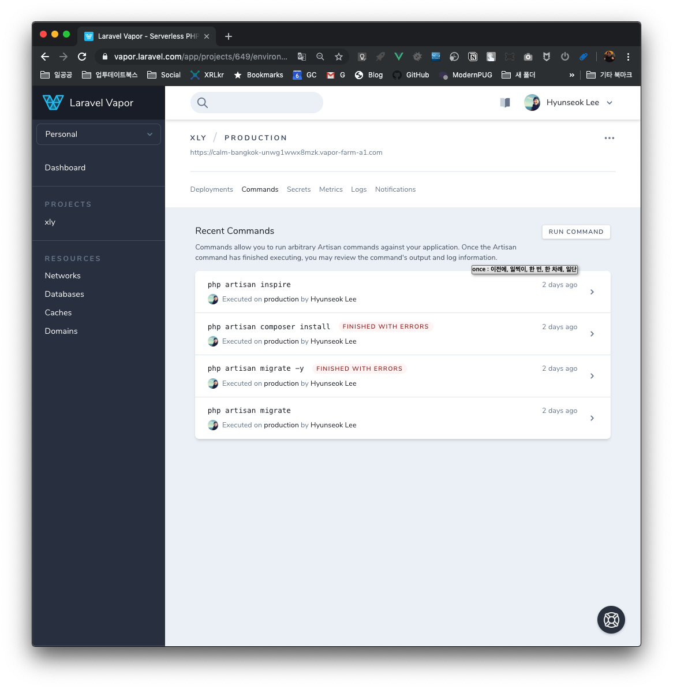
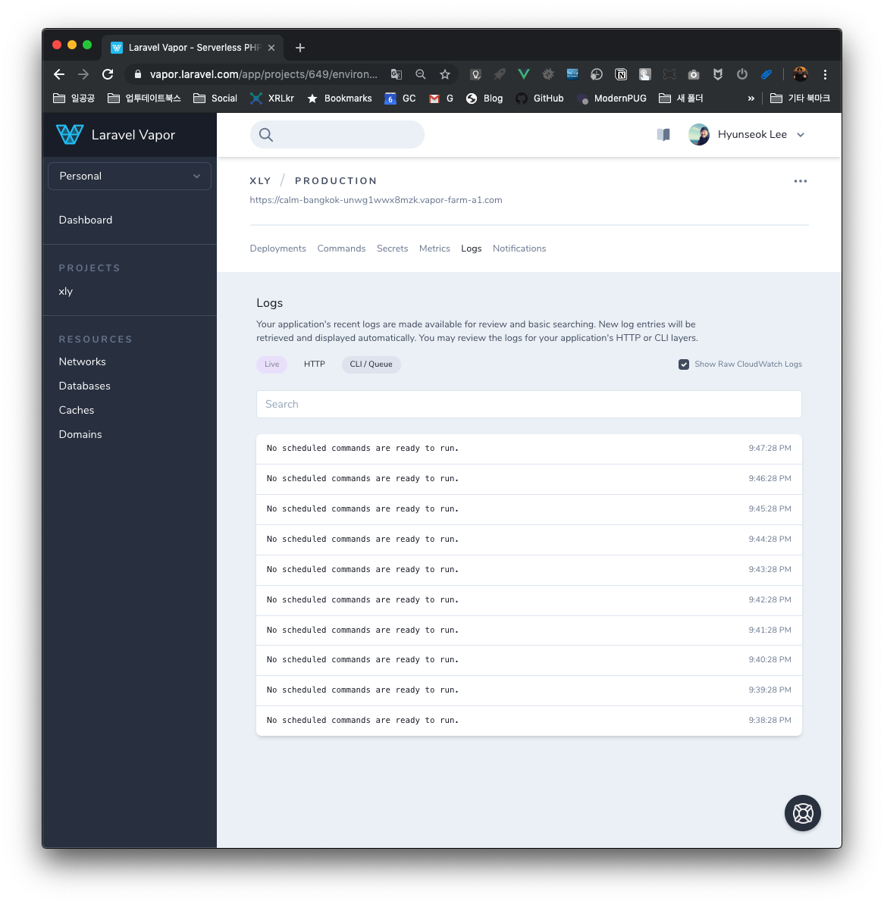
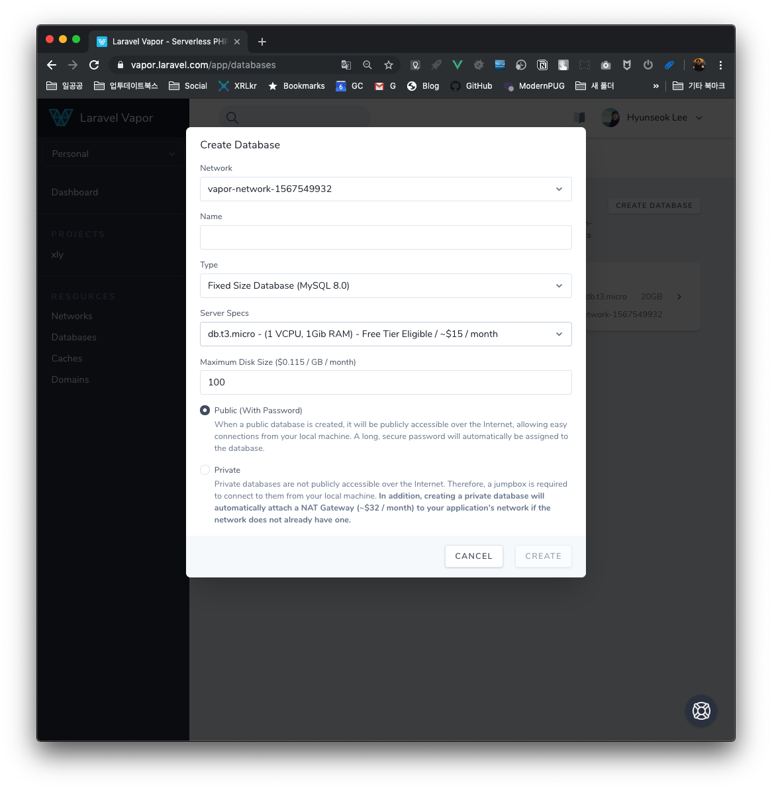
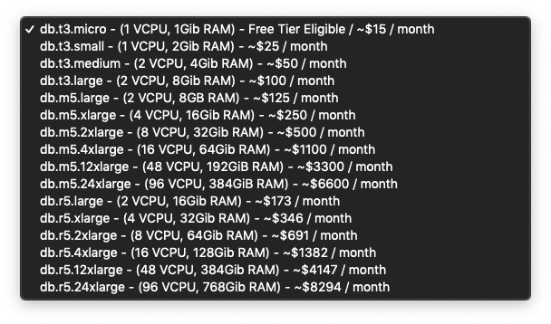
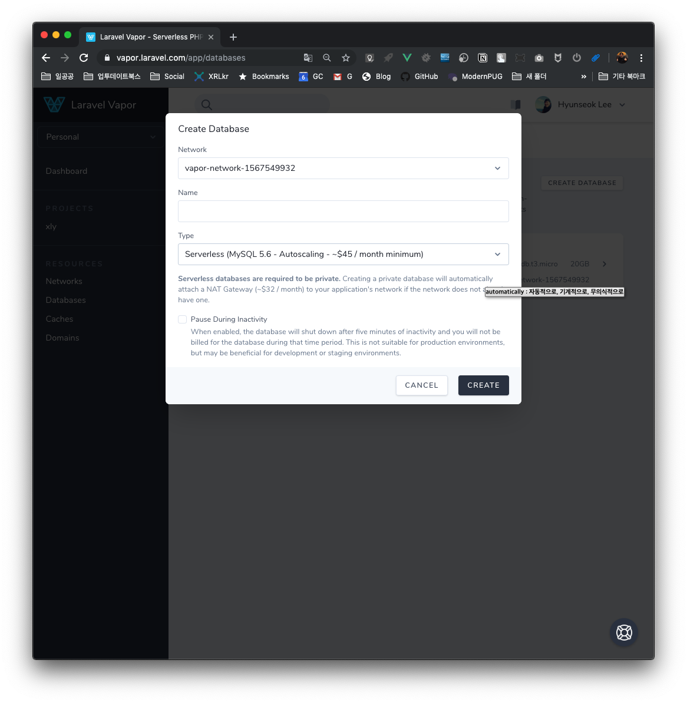
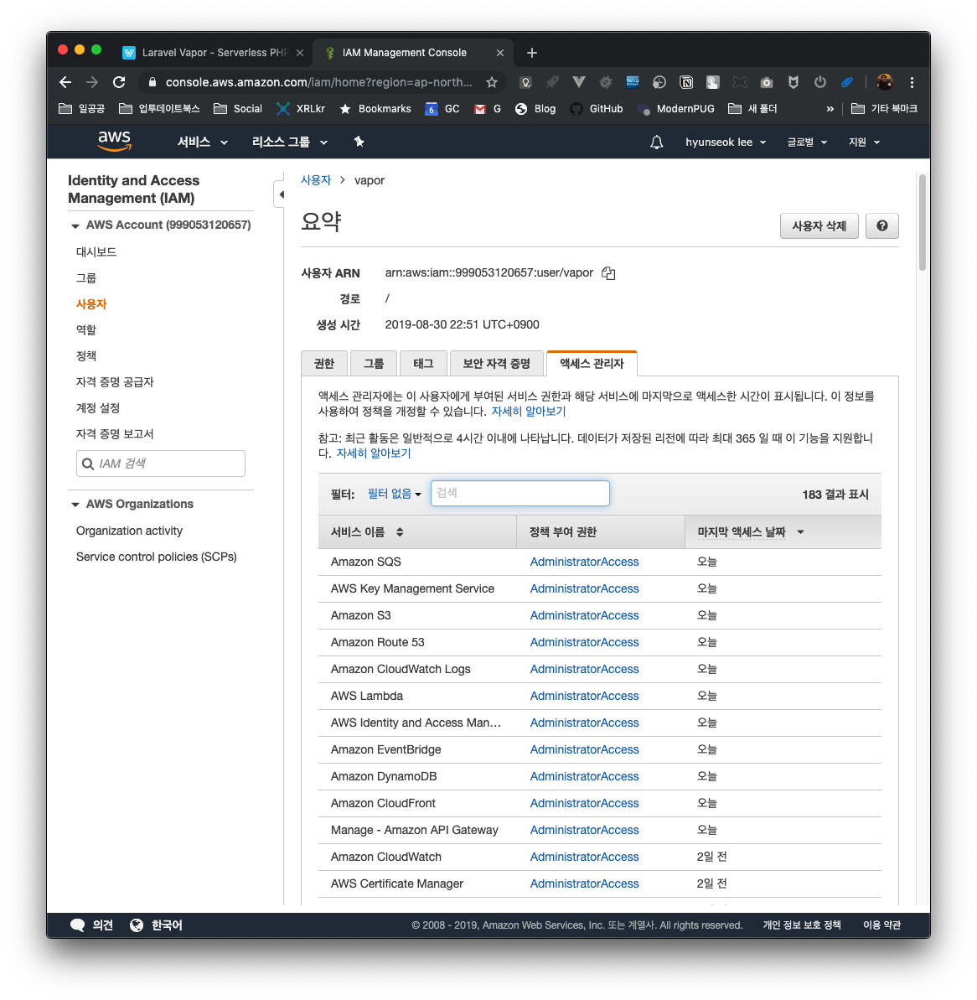

# 라라벨 Vapor 사용기

- [PDF 발표자료](./vapor/Vapor.pdf)(거의 냉무)
- [[1일 1식 라라벨] 라라벨 Vapor](https://leehyunseok.com/?p=3531)
- 라라벨 비용 & 성능 최적화 (Cost & Performance optimization in Laravel Vapor) [원문](https://divinglaravel.com/cost-performance-optimization-in-laravel-vapor)

## 화면 캡쳐

발표 때 보여드렸던 화면 일부를 다시 캡쳐해서 첨부해봤습니다. 질문하셨던 것들을 기억을 더듬어서 찾아봤어요.

### 대시보드

### 프로젝트

여러 환경을 동시에 관리할 수 있습니다.

#### 프로젝트 > 커맨드

웹상에서 커맨드를 실행할 수 있습니다. 물론 콘솔에서도 가능합니다. 

#### 프로젝트 > 로그

로그 볼 수 있습니다.

### 데이터베이스

RDS를 씁니다.

겁나 쎈거까지 고를 수 있습니다. 참고로 데이터베이스 하나를 여러 프로젝트에 써도 됩니다.

서버리스 타입을 고를 수도 있습니다. 기본료가 고정 스펙 데이터베이스보다 비싸기 때문에 어느 정도 사용자가 생기고 나면 써볼만 할 것 같아요.

### AWS

 

어떤 AWS의 서비스를 사용했는지 볼 수 있냐는 질문이 있어서 AWS 콘솔 화면에서 관련 화면을 보여드렸었습니다.